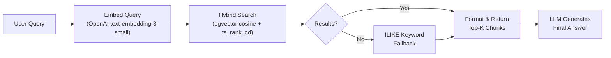

# Improve RAG Search: Retrieval Quality, Ranking & Response Accuracy

## Current System Analysis

After reviewing the full RAG pipeline, here's the current architecture:



### Key Files Analyzed

| File | Role |
|------|------|
| [rag_search.py](file:///d:/Practicals/Qtech/Python/Enterprise_IQ_AI_Engine/engine/modules/assistant/tools/implementations/rag_search.py) | Core search tool: embed → hybrid search → keyword fallback → format |
| [chunking_service.py](file:///d:/Practicals/Qtech/Python/Enterprise_IQ_AI_Engine/engine/pipelines/ingestion/services/chunking_service.py) | 512-token chunks, 50-token overlap, RecursiveCharacterTextSplitter |
| [embedding_service.py](file:///d:/Practicals/Qtech/Python/Enterprise_IQ_AI_Engine/engine/pipelines/ingestion/services/embedding_service.py) | Batch embeddings via OpenAI (text-embedding-3-small, 1536 dims) |
| [rag_context.py](file:///d:/Practicals/Qtech/Python/Enterprise_IQ_AI_Engine/engine/modules/assistant/runtime/rag_context.py) | System prompt enrichment with document inventory |
| [document_model.py](file:///d:/Practicals/Qtech/Python/Enterprise_IQ_AI_Engine/engine/shared/models/document_model.py) | SQLAlchemy models: Document + DocumentChunk (pgvector 1536) |
| [indexing.py](file:///d:/Practicals/Qtech/Python/Enterprise_IQ_AI_Engine/engine/pipelines/ingestion/indexing.py) | Background indexing pipeline: load → chunk → embed → save |
| [knowledge migration](file:///d:/Practicals/Qtech/Python/Enterprise_IQ_AI_Engine/engine/alembic/versions/knowledge_rev_add_knowledge_schema.py) | DB schema with IVFFlat index (lists=100) |

### Identified Weaknesses

| # | Issue | Impact | Severity |
|---|-------|--------|----------|
| 1 | **No query preprocessing** — raw user queries go straight to embedding | Short/vague queries produce poor vectors; stop words and filler reduce cosine similarity | 🔴 High |
| 2 | **No reranking** — hybrid score is the final ranking | Cosine similarity alone doesn't capture semantic nuance; irrelevant chunks can rank high | 🔴 High |
| 3 | **Naive hybrid scoring** — fixed weights `vec=0.75, text=0.25` | No adaptive scoring; text score (ts_rank_cd) and vector score are on different scales without normalization | 🟡 Medium |
| 4 | **No GIN index on tsvector** — full-text scan on every query | `ts_rank_cd(to_tsvector(...), ...)` recomputes tsvector per row; extremely slow at scale | 🔴 High |
| 5 | **Per-query DB connection** — `asyncpg.connect()` creates a new TCP connection each search | Connection overhead ~50-150ms per query; no reuse | 🟡 Medium |
| 6 | **Chunk context is lost** — no parent/neighbor chunk retrieval | When an answer spans two chunks, only one half is returned | 🟡 Medium |
| 7 | **No workspace_id index on chunks** — filter `dc.workspace_id = $3` scans all chunks | Every org-scoped query does a seq scan on workspace_id | 🟡 Medium |
| 8 | **IVFFlat index with low lists** — `lists=100` is suboptimal for <10K and >100K rows | Recall degrades for both very small and very large corpora | 🟠 Low–Med |
| 9 | **Truncated context** — `max_chars_per_chunk=1200`, `max_total_chars=6000` | LLM sees incomplete information; critical details may be cut off | 🟡 Medium |
| 10 | **No conversation-aware retrieval** — each query is independent | Follow-up questions like "tell me more about that" have no context | 🟡 Medium |

---

## Proposed Changes

### Phase 1: Query Preprocessing & Expansion

> Improve the quality of the embedding vector before it hits pgvector.

#### [MODIFY] [rag_search.py](file:///d:/Practicals/Qtech/Python/Enterprise_IQ_AI_Engine/engine/modules/assistant/tools/implementations/rag_search.py)

Add a `_preprocess_query()` method that runs **before** `_embed_query()`:

1. **Stop-word removal** for very short queries — strip filler words ("can you tell me about", "what is the") to sharpen embedding signal
2. **Query expansion** — for single-word queries, generate 2-3 semantic variants using a lightweight prompt (e.g., `"employee benefits" → ["employee benefits", "staff perks and compensation", "HR benefits policy"]`)  
3. **Multi-query decomposition** — for complex compound questions ("What are the leave policies and how do I apply?"), split into sub-queries and merge results via RRF (Reciprocal Rank Fusion)

```python
async def _preprocess_query(self, raw_query: str) -> List[str]:
    """Clean, expand, and optionally decompose the query."""
    cleaned = self._strip_filler(raw_query)
    if len(cleaned.split()) <= 2:
        expanded = await self._expand_short_query(cleaned)
        return [cleaned] + expanded
    return [cleaned]
```

---

### Phase 2: Hybrid Search Scoring Improvements

> Fix the scoring math and add proper full-text support.

#### [NEW] Alembic migration: Add GIN index + stored tsvector column

Add a materialized tsvector column and GIN index for dramatically faster full-text search:

```sql
-- Add computed tsvector column
ALTER TABLE knowledge.document_chunks 
  ADD COLUMN text_search_vector tsvector 
  GENERATED ALWAYS AS (to_tsvector('english', coalesce(text, ''))) STORED;

-- GIN index for fast full-text matching
CREATE INDEX idx_document_chunks_text_gin 
  ON knowledge.document_chunks USING gin(text_search_vector);

-- Workspace isolation index (missing today)  
CREATE INDEX idx_document_chunks_workspace_id 
  ON knowledge.document_chunks (workspace_id);
```

#### [MODIFY] [rag_search.py](file:///d:/Practicals/Qtech/Python/Enterprise_IQ_AI_Engine/engine/modules/assistant/tools/implementations/rag_search.py) — `_vector_search()`

1. **Use stored tsvector** instead of computing `to_tsvector()` per row
2. **Score normalization** — normalize vector_score and text_score to [0,1] before combining
3. **Dynamic weight selection** — when the query is clearly a keyword search (e.g., "DOC-12345"), boost text_weight to 0.6

```sql
-- Updated scoring CTE
WITH scored AS (
    SELECT
        dc.text, d.title, d.reference_id,
        CASE WHEN dc.embedding IS NOT NULL 
             THEN CAST(1 - (dc.embedding <=> $1::vector) AS float)
        END AS vector_score,
        CAST(ts_rank_cd(dc.text_search_vector, plainto_tsquery('english', $2)) AS float) AS text_score
    FROM knowledge.document_chunks dc
    JOIN knowledge.documents d ON d.id = dc.document_id
    WHERE d.deleted_at IS NULL AND d.status = 'indexed'
      AND ($3::uuid IS NULL OR dc.workspace_id = $3::uuid)
      AND (
          dc.embedding IS NOT NULL 
          OR dc.text_search_vector @@ plainto_tsquery('english', $2)
      )
)
```

---

### Phase 3: Cross-Encoder Reranking

> The single highest-impact improvement for retrieval precision.

#### [NEW] [reranker.py](file:///d:/Practicals/Qtech/Python/Enterprise_IQ_AI_Engine/engine/pipelines/ingestion/services/reranker.py)

Add a reranking step after initial retrieval using an LLM-based or cross-encoder reranker:

**Option A — LLM-based reranking (no new model, uses existing LLM):**
- Score each `(query, chunk)` pair with a lightweight prompt: *"Rate relevance 0-10"*
- Re-sort by LLM-assigned relevance score
- Cost: ~1-2 extra LLM calls (batched)

**Option B — Cross-encoder model (local, free after setup):**  
- Use `cross-encoder/ms-marco-MiniLM-L-6-v2` via `sentence-transformers`
- Very fast (~10ms for 20 chunks), extremely accurate
- Requires `pip install sentence-transformers` (~200MB model download)

**Option C — Cohere Rerank API (best accuracy, paid):**
- `cohere.Client().rerank(model="rerank-v3.5", query=..., documents=...)`
- Best precision, ~$1 per 1000 searches

#### [MODIFY] [rag_search.py](file:///d:/Practicals/Qtech/Python/Enterprise_IQ_AI_Engine/engine/modules/assistant/tools/implementations/rag_search.py) — `_search_async()`

Insert reranking between retrieval and return:

```python
async def _search_async(self, query, org_id, top_k, threshold):
    query_vector = await self._embed_query(query)
    # Over-fetch 3x, then rerank to top_k
    candidates = await self._vector_search(query_vector, query, org_id, top_k * 3, threshold)
    if not candidates:
        candidates = await self._keyword_search(query, org_id, top_k * 3)
    # Rerank step  
    reranked = await self._rerank(query, candidates, top_k)
    return reranked
```

> [!IMPORTANT]
> **Which reranking approach do you prefer?** Option A (LLM-based, no new deps) vs Option B (cross-encoder, fastest) vs Option C (Cohere API, most accurate)?

---

### Phase 4: Chunking Strategy Enhancements

> Improve chunk quality so the retriever has better content to work with.

#### [MODIFY] [chunking_service.py](file:///d:/Practicals/Qtech/Python/Enterprise_IQ_AI_Engine/engine/pipelines/ingestion/services/chunking_service.py)

1. **Increase chunk size** from 512 → 1024 tokens with 128-token overlap
   - 512 tokens often splits mid-paragraph; 1024 captures complete sections
   - Modern embedding models handle 8K tokens; 1024 is well within range

2. **Add parent-child chunk structure** (optional, for Phase 2):
   - Store both a "large context chunk" (2048 tokens) and "retrieval chunks" (512 tokens)
   - Search on small chunks, return the parent context to the LLM

3. **Metadata-enhanced chunks** — prepend document title and section headers to chunk text before embedding:
   ```python
   enriched_text = f"Document: {title}\nSection: {section}\n\n{chunk_text}"
   ```
   This dramatically improves embedding quality because the embedding captures document context.

#### [MODIFY] [indexing.py](file:///d:/Practicals/Qtech/Python/Enterprise_IQ_AI_Engine/engine/pipelines/ingestion/indexing.py)

Pass document title and metadata into the chunking step so it can enrich chunk text.

---

### Phase 5: Database & Connection Performance

> Eliminate connection overhead and improve index performance.

#### [MODIFY] [rag_search.py](file:///d:/Practicals/Qtech/Python/Enterprise_IQ_AI_Engine/engine/modules/assistant/tools/implementations/rag_search.py)

**Replace per-query `asyncpg.connect()` with a connection pool:**

```python
import asyncpg

class RAGSearchTool(BaseTool):
    _pool: asyncpg.Pool = None  # class-level pool

    async def _get_pool(self) -> asyncpg.Pool:
        if RAGSearchTool._pool is None:
            RAGSearchTool._pool = await asyncpg.create_pool(
                self._db_url.replace("postgresql+asyncpg://", "postgresql://"),
                min_size=2, max_size=10,
                command_timeout=15,
            )
        return RAGSearchTool._pool
```

This removes ~100ms connection setup latency per search.

#### [NEW] Alembic migration: Upgrade vector index

Consider upgrading from IVFFlat → HNSW for better recall at low `top_k`:

```sql
-- Drop old IVFFlat index
DROP INDEX IF EXISTS knowledge.idx_document_chunks_embedding_ivfflat;

-- Create HNSW index (better recall, slightly more memory)
CREATE INDEX idx_document_chunks_embedding_hnsw
  ON knowledge.document_chunks 
  USING hnsw (embedding vector_cosine_ops)
  WITH (m = 16, ef_construction = 64);
```

> [!NOTE]
> HNSW provides ~95-99% recall vs IVFFlat's ~80-90%, with marginally higher memory usage. HNSW is the industry standard for <1M vectors.

---

### Phase 6: Context Formatting & LLM Integration

> Give the LLM better-formatted context so it generates more accurate responses.

#### [MODIFY] [rag_search.py](file:///d:/Practicals/Qtech/Python/Enterprise_IQ_AI_Engine/engine/modules/assistant/tools/implementations/rag_search.py) — `_format_results()`

1. **Increase context limits** — raise `max_chars_per_chunk` from 1200 → 2000 and `max_total_chars` from 6000 → 12000 (modern LLMs handle 100K+ context easily)
2. **Add chunk metadata** — include page numbers, section headers, and document type
3. **Deduplicate overlapping chunks** — when two consecutive chunks from the same document overlap significantly, merge them
4. **Add confidence indicators** — tag chunks as "High confidence" / "Moderate" / "Low" based on similarity scores

#### [MODIFY] [rag_context.py](file:///d:/Practicals/Qtech/Python/Enterprise_IQ_AI_Engine/engine/modules/assistant/runtime/rag_context.py)

1. **Add RAG workflow instructions** — the `RAG_WORKFLOW_INSTRUCTIONS` constant exists but is never injected into the system prompt
2. **Structured citation format** — tell the LLM to cite sources with consistent formatting

---

## Implementation Priority & Effort

| Phase | Impact | Effort | Priority |
|-------|--------|--------|----------|
| Phase 1: Query preprocessing | 🔴 High | ~4 hrs | P0 |
| Phase 2: GIN index + scoring fix | 🔴 High | ~3 hrs | P0 |
| Phase 3: Reranking | 🔴 High | ~4 hrs | P0 |
| Phase 4: Chunking improvements | 🟡 Medium | ~3 hrs | P1 |
| Phase 5: Connection pool + HNSW | 🟡 Medium | ~3 hrs | P1 |
| Phase 6: Context formatting | 🟡 Medium | ~2 hrs | P2 |

**Recommended execution order:** Phase 2 → Phase 5 → Phase 1 → Phase 3 → Phase 6 → Phase 4

> Start with DB-level fixes (free performance), then retrieval quality, then formatting.

---

## Open Questions

> [!IMPORTANT]
> **1. Reranking approach:** Which reranking option do you prefer?
> - **A)** LLM-based (no new dependency, uses your existing Anthropic/OpenAI key)
> - **B)** Cross-encoder model (`sentence-transformers`, ~200MB, runs locally, fastest)
> - **C)** Cohere Rerank API (best accuracy, ~$1/1000 queries)

> [!IMPORTANT]
> **2. Chunk size increase:** Increasing chunk size from 512 → 1024 tokens would require **re-indexing all existing documents**. Is that acceptable?

> [!IMPORTANT]
> **3. HNSW migration:** Switching from IVFFlat → HNSW index is a one-time migration but will rebuild the index. Acceptable downtime?

> [!NOTE]
> **4. Query expansion via LLM:** Phase 1 query expansion uses an additional LLM call for short queries. This adds ~200-500ms latency and ~$0.001/query cost. Is this acceptable?

> [!NOTE]
> **5. Phase scope:** Would you like me to implement all 6 phases, or start with a subset (recommended: Phase 2 + 5 first for "free" performance wins)?

---

## Verification Plan

### Automated Tests
```bash
# Run existing tests to ensure no regressions
pytest tests/ -v --tb=short

# New tests for each phase
pytest tests/test_rag_search.py -v
pytest tests/test_chunking_service.py -v
pytest tests/test_reranker.py -v
```

### Manual Verification
- Use the `/documents/search` endpoint to compare search results before and after changes
- Test with:
  - Short queries: "leave policy"
  - Long queries: "What is the procedure for requesting annual leave and who needs to approve it?"
  - Ambiguous queries: "benefits" 
  - Follow-up queries: "tell me more about the third one"
  - Edge cases: empty query, single character, document ID lookup
- Compare `vector_score`, `text_score`, and `similarity` scores before/after
- Verify HNSW recall improvement with known document → query pairs
